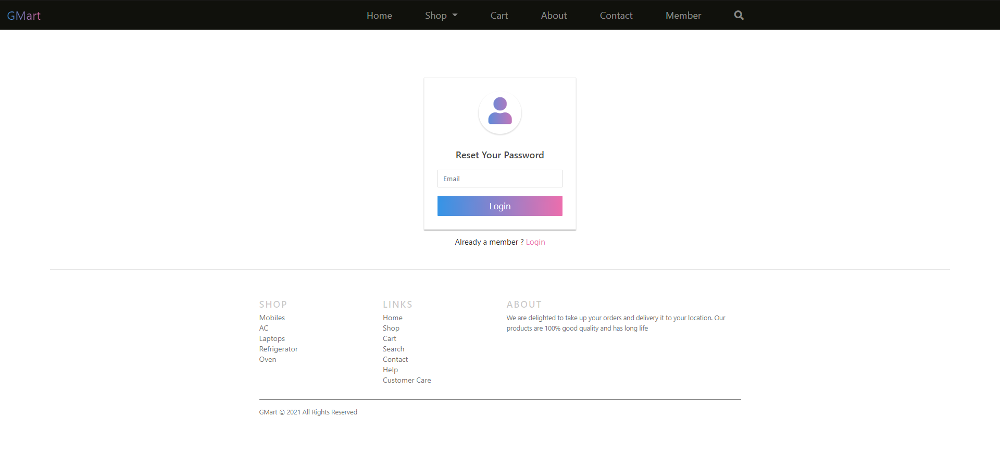
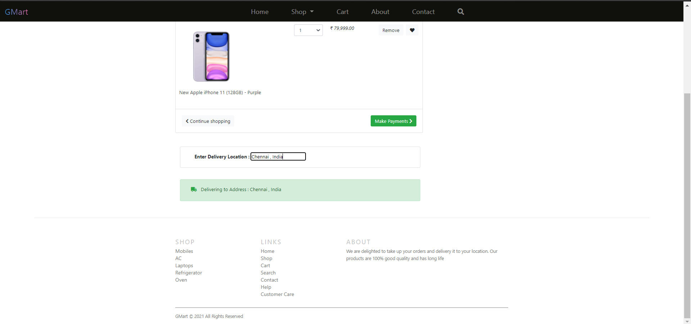

# Gmart
This a Ecommerce based website built with Angular and deployed using Firebase

# Website Images





# Steps for deployment
  1. Create a firebase account
  2. Install Firebase CLI 
     ```
     npm install firebase @angular/fire
     ```
  3. Run production build command for Angular
     ```
     ng build --prod
     ```
  4. Login to your Firebase account 
     ```
     firebase login
     ```
  5. Initialise your project for firebase in root directory
     ```
     firebase init
     ```
  6. Deploy your project by choosing hosting as option and enable single page routing and be sure to say **no** to rewrite index.html
     ```  
     firebase deploy
     ```
